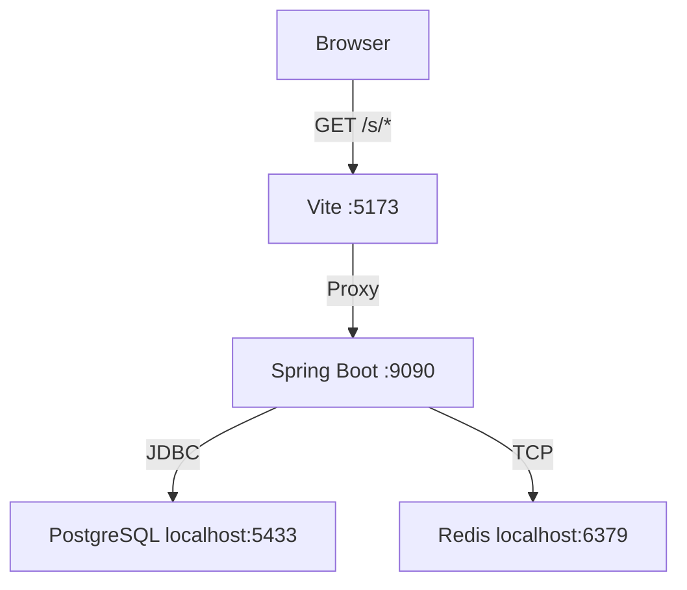
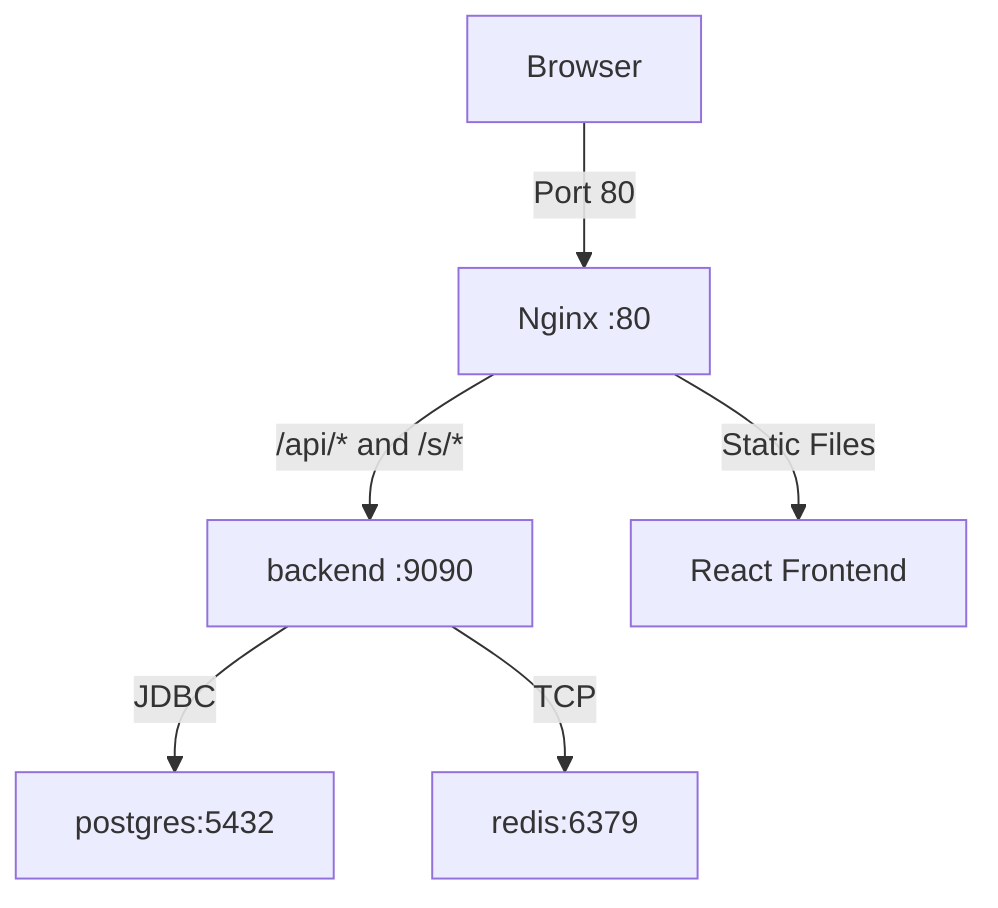

# LinkForge

LinkForge is a full-stack, enterprise-grade URL management and shortening platform. Designed with modern architecture, it provides users with a fast, responsive interface to manage links, track engagement analytics, and seamlessly redirect traffic.

The platform supports both a high-performance **Local Development Mode** and a robust **Full Docker Mode**, making it easy to develop locally and deploy reliably.

---

## 1. Features

LinkForge provides the following capabilities:
- **User Authentication:** Secure registration and login using stateless JWT (JSON Web Tokens).
- **URL Shortening:** Generate randomized short URLs or specify custom aliases.
- **URL Management:** A modern dashboard to view, manage, and delete shortened URLs.
- **Expiration Dates:** Option to set expiration dates for temporary short links.
- **Fast Redirections:** Quick HTTP 302 redirects managed by the Spring Boot backend with Redis caching.
- **Click Analytics:** Real-time click counting and historical event tracking.
- **Data Visualization:** A beautiful dashboard featuring rolling 30-day engagement graphs.
- **Modern UI/UX:** A SaaS-style design using Tailwind CSS, responsive layouts, and micro-animations.

---

## 2. Technology Stack

LinkForge is built with a robust, modern technology stack:

### Frontend
- **React 18.3** (Vite 6.2)
- **Tailwind CSS 3.4** (Styling and responsive design)
- **Axios 1.7** (HTTP Client)
- **React Query 3.39** (Data fetching and state management)
- **Chart.js 4.4 & react-chartjs-2** (Analytics visualization)
- **Day.js** (Date manipulation)

### Backend
- **Java 21**
- **Spring Boot 3.4.1**
- **Spring Security** (Authentication and CORS management)
- **Spring Data JPA & Hibernate** (ORM)
- **JJWT 0.12.6** (JSON Web Token implementation)
- **Maven** (Build tool)

### Infrastructure
- **PostgreSQL 15** (Primary relational database)
- **Redis 7** (Caching and fast lookups)
- **Docker & Docker Compose** (Containerization)
- **Nginx** (Reverse proxy in Docker mode)

---

## 3. System Architecture

The application supports two distinct networking architectures to provide maximum flexibility during development.

### Local / Hybrid Mode

In this mode, PostgreSQL and Redis run inside Docker, while Spring Boot and React/Vite run directly on your local machine.


*Note: PostgreSQL is mapped to host port `5433` to prevent conflicts if you already have a local PostgreSQL instance running on the default `5432` port.*

### Full Docker Mode

In this mode, the entire stack runs inside Docker, orchestrated by Docker Compose. Nginx serves as the reverse proxy for both the frontend and backend.



---

## 4. How URL Shortening Works

The lifecycle of a short URL in LinkForge:
1. **Creation:** A user submits a long URL via the frontend.
2. **Generation:** The Spring Boot backend generates a unique short code (or validates a custom alias) and stores it in PostgreSQL.
3. **Distribution:** The frontend constructs the public short URL using the current browser origin (e.g., `http://localhost:5173/s/abcd123`).
4. **Redirection Request:** The user visits `/s/abcd123`.
5. **Routing:** The request hits the Spring Boot backend (routed through Vite proxy or Nginx).
6. **Lookup & Analytics:** The backend resolves the URL (checking Redis first, then PostgreSQL), increments the overall `click_count`, and asynchronously records a `click_event`.
7. **Redirect:** The backend returns an HTTP 302 redirect, instructing the browser to navigate to the original URL.

*Note: Redirections are handled entirely by the backend, not the React frontend.*

---

## 5. Short URL Routing

The final routing endpoint for short URLs is:
`GET /s/{shortUrl}`

Depending on your environment, the request flows differently:
- **Local:** `http://localhost:5173/s/{shortCode}` → proxied by Vite to Spring Boot.
- **Docker:** `http://localhost/s/{shortCode}` → proxied by Nginx to Spring Boot.

---

## 6. Authentication

LinkForge uses **Stateless JWT Authentication**.
- **Public Endpoints:** Login and Registration are open.
- **Protected Endpoints:** URL management and analytics require a valid Bearer token.
- **Password Security:** Passwords are hashed using BCrypt before being stored in the database.

*Note: No default/demo credentials are seeded. Users must register through the application.*

---

## 7. Database Configuration

LinkForge uses PostgreSQL 15. The internal container name is `linkforge-postgres`.

| Environment | JDBC URL | Description |
|---|---|---|
| **Local** | `jdbc:postgresql://localhost:5433/linkforge` | Connects via the exposed host port. |
| **Docker** | `jdbc:postgresql://postgres:5432/linkforge` | Connects via internal Docker DNS. |

### Key Tables
1. **`users`**: Stores `id`, `username`, `email`, `password` (hashed), and `role` (`ROLE_USER`).
2. **`url_mapping`**: Stores `id`, `original_url`, `short_url`, `click_count`, `created_date`, `expires_at`, and a foreign key to `user_id`.
3. **`click_event`**: Stores individual `id`, `click_date`, and a foreign key to `url_mapping_id`.

---

## 8. pgAdmin / Database Management

To inspect the database using a local pgAdmin installation while running Local/Hybrid mode:
- **Host:** `localhost`
- **Port:** `5433` *(DO NOT use 5432)*
- **Database:** `linkforge`
- **Username:** `postgres`
- **Password:** *(the value you configured in your `.env` file)*

Alternatively, you can inspect the database directly via Docker:
```bash
docker exec -it linkforge-postgres psql -U postgres -d linkforge
```
*Tip: Use `\dt` to list tables, or `SELECT * FROM users;` to view data.*

---

## 9. Redis

Redis is utilized to cache short URL lookups, ensuring highly performant redirection.
- **Docker Hostname:** `redis:6379`
- **Local Hostname:** `localhost:6379`
- **TTL Configuration:** Caches expire based on the `REDIS_DEFAULT_TTL_DAYS` environment variable (default: 7 days) or the URL's specific expiration date.

---

## 10. Analytics

LinkForge tracks analytics at two levels:
1. **`click_count`**: A raw integer on the `url_mapping` table tracking the lifetime total clicks.
2. **`click_event`**: Individual timestamped records in the `click_event` table.

**Rolling 30-Day Window:**
The frontend dashboard and individual URL analytics graphs display engagement data for a rolling 30-day window ending on the current day. This ensures performance and relevant metrics.

---

## 11. CORS (Cross-Origin Resource Sharing)

CORS is managed natively by Spring Security. The allowed origins adapt based on the environment:
- **Local:** `http://localhost:5173`
- **Docker:** `http://localhost`

---

## 12. Environment Configuration

LinkForge uses a unified, single-source-of-truth configuration architecture. 

```text
LinkForge/
├── .env          (Your actual configuration; NEVER committed)
└── .env.example  (The safe template; tracked by Git)
```

The root `.env` defines your configuration for **Local Development**. When you run the stack in **Full Docker Mode**, `docker-compose.yml` automatically overrides the networking variables (like `DB_URL` and `FRONTEND_URL`) to use Docker-internal networking, requiring zero code or configuration edits to switch modes.

### Variables in `.env.example`
- **Postgres:** `POSTGRES_DB`, `POSTGRES_USER`, `POSTGRES_PASSWORD`
- **Local Overrides:** `DB_URL`, `DB_USERNAME`, `DB_PASSWORD`, `REDIS_HOST`, `REDIS_PORT`, `FRONTEND_URL`
- **Security:** `JWT_SECRET`, `JWT_EXPIRATION`
- **System:** `PORT`, `REDIS_DEFAULT_TTL_DAYS`, `ASYNC_CORE_POOL_SIZE`, `ASYNC_MAX_POOL_SIZE`, `ASYNC_QUEUE_CAPACITY`

---

## 13. Local Development Setup

Follow these exact steps to run the application in Local/Hybrid mode.

**Prerequisites:** Git, JDK 21, Node.js/npm, Docker Desktop.

### Step 1: Clone Repository
```powershell
git clone <repository-url>
cd LinkForge
```

### Step 2: Configure Environment
Copy the example environment file and fill in your secrets.
```powershell
Copy-Item .env.example .env
```
*(Open `.env` and replace placeholders like `JWT_SECRET` and `POSTGRES_PASSWORD` with secure values).*

### Step 3: Start Infrastructure
Start PostgreSQL and Redis in Docker.
```powershell
docker compose up -d postgres redis
```

### Step 4: Start Backend
Spring Boot will automatically detect and load your root `.env` configuration.
```powershell
cd Url-Shortner-sb
.\mvnw.cmd spring-boot:run
```

### Step 5: Start Frontend
Open a new terminal window.
```powershell
cd Url-Shortner-Frontend
npm install
npm run dev
```

### Step 6: Test
Open `http://localhost:5173` in your browser.

---

## 14. Full Docker Setup

To run the entire application stack (Frontend, Backend, Postgres, Redis) in Docker containers.

### Step 1: Configure Environment
Copy the example environment file and fill in your secrets.
```powershell
Copy-Item .env.example .env
```

### Step 2: Build and Start
Run docker compose from the root directory.
```powershell
docker compose up -d --build
```

### Step 3: Verify & Access
Check container status:
```powershell
docker compose ps
```
Open `http://localhost` in your browser.

### Useful Docker Commands
- `docker compose logs backend` (View backend logs)
- `docker compose down` (Stop containers)
- `docker compose down -v` (**WARNING:** Stops containers AND deletes your persistent PostgreSQL database volume)

---

## 15. Local vs Docker Architecture Summary

| Component | Local/Hybrid | Full Docker |
|---|---|---|
| **Frontend UI** | `http://localhost:5173` | `http://localhost:80` |
| **Backend API** | `localhost:9090` | `localhost:9090` (externally) |
| **PostgreSQL** | `localhost:5433` | `postgres:5432` (internally) |
| **Redis** | `localhost:6379` | `redis:6379` (internally) |
| **Reverse Proxy**| Vite Proxy | Nginx |
| **Short URL** | `http://localhost:5173/s/...` | `http://localhost/s/...` |

---

## 16. API Documentation

Key endpoints exposed by the Spring Boot backend:

### Authentication Endpoints (Public)
- `POST /api/auth/public/register`: Register a new user.
- `POST /api/auth/public/login`: Authenticate and receive a JWT.

### URL Management (Requires JWT)
- `POST /api/urls/shorten`: Create a new short URL.
- `GET /api/urls/myurls`: Retrieve all URLs for the authenticated user.
- `DELETE /api/urls/{shortUrl}`: Delete a URL and its analytics.

### Analytics (Requires JWT)
- `GET /api/urls/analytics/{shortUrl}?startDate=...&endDate=...`: Get click events for a specific URL.
- `GET /api/urls/totalClicks?startDate=...&endDate=...`: Get total click events across all user URLs.

### Redirection (Public)
- `GET /s/{shortUrl}`: Resolves the short code and performs a 302 redirect.

### System
- `GET /actuator/health`: System health check.

---

## 17. Project Structure

```text
LinkForge/
├── .env                 # Environment configuration (ignored)
├── .env.example         # Template configuration
├── .gitignore           # Root gitignore
├── docker-compose.yml   # Docker orchestration
├── README.md            # Project documentation
│
├── Url-Shortner-sb/     # Backend Module (Java/Spring Boot)
│   ├── src/             # Java source code
│   ├── pom.xml          # Maven dependencies
│   ├── mvnw.cmd         # Maven wrapper (Windows)
│   └── Dockerfile       # Backend Docker image definition
│
└── Url-Shortner-Frontend/ # Frontend Module (React/Vite)
    ├── src/             # React source code
    ├── package.json     # Node dependencies
    ├── vite.config.js   # Vite proxy configuration
    ├── Dockerfile       # Frontend Docker image definition
    └── nginx.conf       # Nginx reverse proxy routing
```

---

## 18. Troubleshooting

**Java Version Mismatch**
The backend requires Java 21. If you encounter class-version errors (like `UnsupportedClassVersionError`), verify your active Java version using `java -version` and `.\mvnw.cmd -version`.

**PostgreSQL Port Conflict**
LinkForge maps Docker's internal PostgreSQL to your host's port `5433`. If you attempt to connect via `5432` locally, you may connect to a different database running on your machine.

**Analytics Showing No Clicks**
The frontend requests analytics using a rolling 30-day window. Ensure your clicks occurred recently and that your computer's date/time is correctly synchronized.

**Short URL 404**
The routing path must exactly match `/s/{shortCode}`. Ensure the backend is running, as React does not perform the redirect itself.

---

## 19. Security Guidelines

- **Never commit `.env`**: It is explicitly ignored in `.gitignore`.
- **Secret Generation**: Ensure your `JWT_SECRET` is a long, cryptographically secure, random string (minimum 256-bit).
- **Database Passwords**: Do not use the default `postgres` password in production.

---

## 20. Production / Real-World Use

While this architecture is fully capable of real URL shortening, the provided configuration (`localhost`) is designed for development. For a real-world public deployment, you must:
- Host the application behind a public domain with HTTPS/TLS.
- Utilize a managed production database or secure your Docker volumes.
- Update `FRONTEND_URL` and CORS configurations to match your production domain.
- Implement rate limiting and robust monitoring.

---

## 21. Verification Checklists

### Local/Hybrid Verification
- [ ] PostgreSQL container healthy (`docker compose ps`)
- [ ] Redis container healthy (`docker compose ps`)
- [ ] Spring Boot running on `9090` without errors
- [ ] Vite running on `5173`
- [ ] Registration & Login successful
- [ ] URL creation successful
- [ ] Short URL redirect successful (`/s/...`)
- [ ] Click counts incrementing
- [ ] Analytics graph displaying data
- [ ] Data persists after restarting backend

### Full Docker Verification
- [ ] PostgreSQL healthy
- [ ] Redis healthy
- [ ] Backend healthy
- [ ] Frontend healthy
- [ ] Can access application at `http://localhost`
- [ ] Registration & Login successful
- [ ] URL creation successful
- [ ] Short URL redirect successful (`/s/...`)
- [ ] Click counts incrementing
- [ ] Analytics graph displaying data
- [ ] Data persists after `docker compose down` and `up -d` (unless using `-v`)
